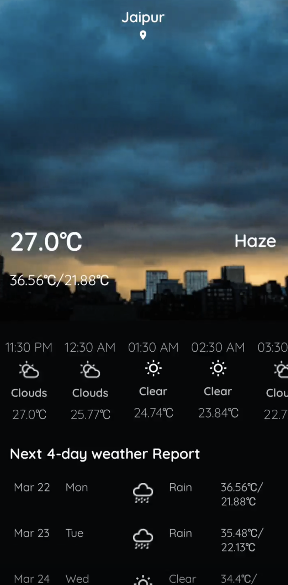
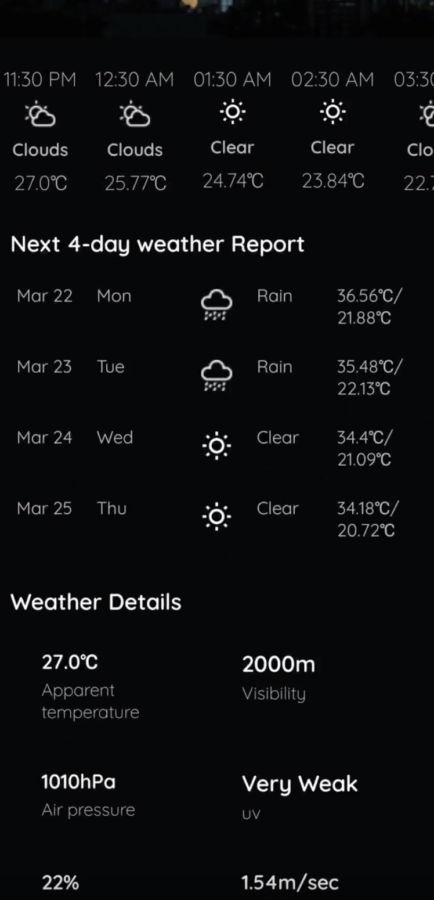
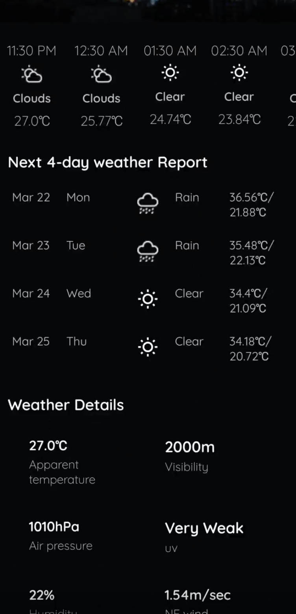

# TrackWeather

<p>TrackWeather is an Android application designed to provide weather updates using a weather API. It follows modern Android development practices, incorporating the MVVM architecture, Koin for dependency injection, and Kotlin Coroutines for asynchronous programming.</p>

## Prerequisites

- A Weather API Client ID is required. Obtain one from your preferred weather service provider and add it to `Constants.kt`.

## Project Structure

### Home Page
- Displays current weather information retrieved via the Weather API.
- Provides a user-friendly interface with essential weather details.

### Details Page
- Shows detailed weather information including forecasts.
- Displays additional data such as humidity, wind speed, and more.

<div style="display: flex; flex-wrap: wrap; gap: 10px;">

  
  
</div>


## Features

1. **MVVM Architecture Pattern**
   - Ensures a clean separation of concerns and enhances testability.
   - Divides the project into three main components: Model, View, and ViewModel.

2. **Retry Option**
   - Allows users to retry network calls if they fail.
   - Implements a user-friendly way to handle network errors.

3. **Responsive Design**
   - Compatible with both phones and tablets.
   - Ensures a consistent user experience across different screen sizes.

4. **Pull to Refresh**
   - Refreshes the content with a swipe gesture.
   - Provides an intuitive way for users to update the displayed data.

## Libraries Used

<ul>
  <li><strong>Android Architecture Components</strong>
    <ul>
      <li>ViewModel: Manages UI-related data in a lifecycle-conscious way.</li>
      <li>LiveData: Handles data updates and UI notifications.</li>
      <li>Room: Provides an abstraction layer over SQLite to allow for more robust database access while harnessing the full power of SQLite.</li>
    </ul>
  </li>
  <li><strong>Dependency Injection</strong>
    <ul>
      <li>Koin: A lightweight dependency injection framework for Kotlin.</li>
    </ul>
  </li>
  <li><strong>Asynchronous Programming</strong>
    <ul>
      <li>Kotlin Coroutines: Simplifies asynchronous programming and provides a cleaner way to manage background tasks.</li>
    </ul>
  </li>
  <li><strong>Networking</strong>
    <ul>
      <li>Retrofit: A type-safe HTTP client for Android and Java.</li>
    </ul>
  </li>
  <li><strong>Image Loading</strong>
    <ul>
      <li>Glide: An image loading and caching library for Android focused on smooth scrolling.</li>
    </ul>
  </li>
</ul>

## Getting Started

### Installation

1. **Clone the repository**
   ```sh
   git clone https://github.com/arunsinghrwt/TrackWeather.git
   cd TrackWeather
   ```

2. **Add Weather API Key**
   - Open `Constants.kt` located in `TrackWeather/app/src/main/java/com/arun/trackweather/Application/Utility/Constants.kt`.
   - Add your Weather API Client ID:
     ```kotlin
     const val WEATHER_API_KEY = "YOUR_WEATHER_API_KEY"
     ```

3. **Build the project**
   - Open the project in Android Studio.
   - Sync the project with Gradle files.
   - Build and run the project on an Android device or emulator.

## Usage

- **Home Page**: View current weather information. The main screen provides essential weather details.
- **Details Page**: Tap on any weather card to view detailed weather information including forecasts and additional data.
- **Pull to Refresh**: Swipe down on the home page to refresh the weather data.

## Contributing

Contributions are welcome! Please fork the repository and submit a pull request for any improvements or bug fixes.

## License

This project is licensed under the MIT License. See the [LICENSE](LICENSE) file for details.

For more details, visit the [TrackWeather Repository](https://github.com/arunsinghrwt/TrackWeather).

